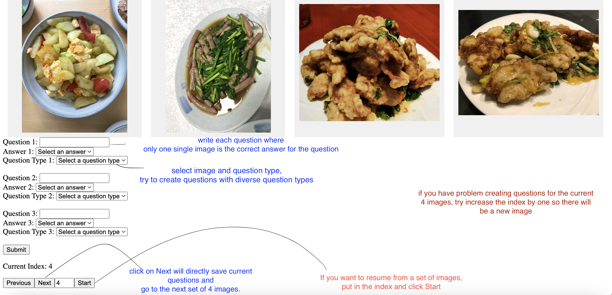
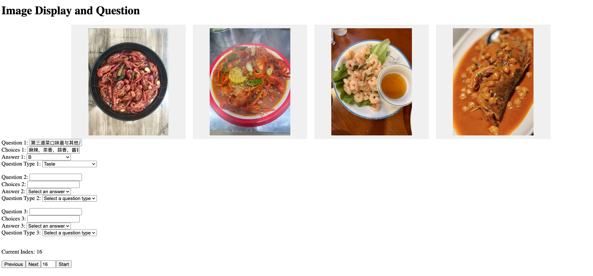
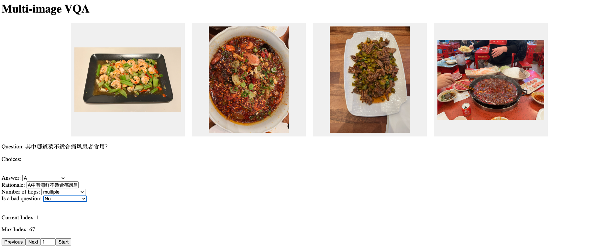

# Foodie-eval

Evaluate LLMs/VLMs with the foodie benchmark


## Models
### LLMs
- `Yi-6B` 

### VLMs
- `Yi-VL-6B`
- `Yi-VL-34B`

## Scripts
- `eval_text_qa.ipynb`  zero-shot and one-shot evaluation of the text QA.


## Image survey preprocessing
Images and corresponding CSV files can be downloaded from [google drive](https://drive.google.com/drive/folders/1haSXSPMfdYBpkg4wspC0qkxZd16llbDD?usp=sharing)

Use `image_data_cleaning.ipynb` to parse it into clean json files.

## VQA 
### question formulation
`cd ui` 

- Download all files from [here](https://drive.google.com/drive/folders/1WFHN8oznqwAdeGXMGlxJbdCbi1l-zL0R?usp=sharing) to a local folder. Unzip the .zip files and set the `img_folder` to your local folder path in `config.yaml`.
      

- Edit `config.yaml` 
    - if food_category_file is "processed_food_category_ingredient", select `food_category` from
        ```
        ["seafood", "meat", "vegetable", "tofu", "main-noodle", "main-bao", "main-rice", "main-bread", "main-other", "main-soup", "main-hotpot", "snack", "bbq", "other"]
        ```

    - if food_category_file is "processed_food_category_region", select `food_category` from 
        ```["川", "湘", "赣", "黔", "徽", "闽", "粤", "浙", "苏", "鲁", "新疆","东北","西北", "内蒙", "上海", "其他"]```

    ```
    food_category_file: "processed_food_category_region" 
    img_folder: "/Users/wli/projects/foodie-dataset/data-collection"
    food_category: "其他" 
    save_folder: "image-qa"  # folder name to save annotations
    ```

- Start UI
    ```
    python3 -m venv foodie
    conda activate foodie
    pip install flask

    python app.py
    ```
- Use the UI as the in the 
Allow choices to the answers to be non-images, **add choices split by comma ","**, see example as in . The "choices" field is optional.


### Question validation
**Multi-image VQA**
Similar as in question formulation, but `cd val-ui`
- Download the json file [here](https://drive.google.com/file/d/1AjgJ-L2fwIS5D0ZTMTMYd9UsPo99RSHZ/view?usp=drive_link)
- Config the `config.yaml`, run `python app.py`. 
notice that `food_categories: ["川", "上海"]` now supports multiple categories as a list.
- Use the UI as see the example in the 
    - Mark "Is bad question" as *Yes* if you think the question is confusing and should not be included in the dataset
    - Mark "Number of hops" as **single** if it is a question that **does not** require reasoning. e.g. 哪道菜菜色更亮？Mark it as **multiple** if it is a question require you to reason for multiple steps, e.g. 需要先辨认食物名称，或食物食材等. 如哪道菜不适合痛风患者食用？ 这类问题需要先辨认食材是否包含海鲜类食物，如包含海鲜，则不适合痛风患者食用。
- Other features such as click **Next** to save and start index are the same as last time.


**Single-image VQA**

- Download the `single-image-vqa-splitted.json` file [here](https://drive.google.com/file/d/1niyTD0bi1eEcZZE4nm612asAZU0lLn2u/view?usp=drive_link) (to the same folder as before)
- `cd val-ui`
- Config the `single_vqa_config.yaml`, run `python single_vqa_app.py`. 
notice that `food_categories: ["0"] is or ["1"] or your assigned group.
- Use the UI as see the example in the , in this time the difference is only that there are text choices, and one image.
    - Mark "Is bad question" as *Yes* if you think the question is confusing and should not be included in the dataset, e.g. not only one choice is correct, too simple, does not require the image to answer.
    - Mark "Number of hops" as **single** if it is a question that **does not** require reasoning. 
- Other features such as click **Next** to save and start index are the same as last time.

**Text QA**
- Download the `text-qa-splitted.json` file [here](https://drive.google.com/file/d/1Xma0JBawYBaBDYc1ALI1SHcoRg6poHwO/view?usp=drive_link) (to the same folder as before)
- `cd val-ui`
- Config the `text_qa_config.yaml`, run `python text_qa_app.py`. 
notice that `food_categories: ["0"] is or ["1"] or your assigned group.
- The UI does not require you to put in rationale, and there are only text choices.
    - If you do not know the answer, rather than guess, select, **I do not know**.
    - Mark "Is bad question" as *Yes* if you think the question is confusing and should not be included in the dataset, e.g. not only one choice is correct, too simple, too hard, the choices does not make sense, etc.
    - Mark "Number of hops" as **single** if it is a question that **does not** require reasoning. 
- Other features such as click **Next** to save and start index are the same as last time.
