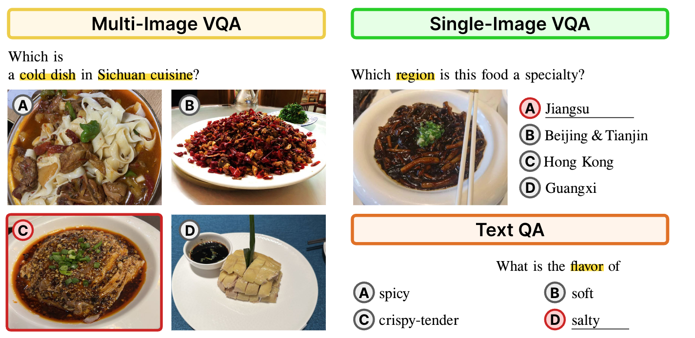

# FoodieQA

Evaluate LLMs/VLMs with the FoodieQA benchmark

## Benchmark



🤗 Available on HuggingFace [lyan62/FoodieQA](https://huggingface.co/datasets/lyan62/FoodieQA)

License: [CC-BY-NC-ND 4.0](https://creativecommons.org/licenses/by-nc-nd/4.0/deed.en)

## Models
### LLMs
- `Yi-6B` 

### VLMs
- `Yi-VL-6B`
- `Yi-VL-34B`


## UI
- See [UI README](ui/README.md) for using the UI to create questions and ground truth labels for Multi-image VQA task.

### Question validation
**Multi-image VQA**
Similar as in question formulation, but `cd val-ui`
- Download the json file [here](https://drive.google.com/file/d/1AjgJ-L2fwIS5D0ZTMTMYd9UsPo99RSHZ/view?usp=drive_link)
- Config the `config.yaml`, run `python app.py`. 
notice that `food_categories: ["川", "上海"]` now supports multiple categories as a list.
- Use the UI as see the example in the 
    - Mark "Is bad question" as *Yes* if you think the question is confusing and should not be included in the dataset
    - Mark "Number of hops" as **single** if it is a question that **does not** require reasoning. e.g. 哪道菜菜色更亮？Mark it as **multiple** if it is a question require you to reason for multiple steps, e.g. 需要先辨认食物名称，或食物食材等. 如哪道菜不适合痛风患者食用？ 这类问题需要先辨认食材是否包含海鲜类食物，如包含海鲜，则不适合痛风患者食用。
- Other features such as click **Next** to save and start index are the same as last time.


**Single-image VQA**

- Download the `single-image-vqa-splitted.json` file [here](https://drive.google.com/file/d/1niyTD0bi1eEcZZE4nm612asAZU0lLn2u/view?usp=drive_link) (to the same folder as before)
- `cd val-ui`
- Config the `single_vqa_config.yaml`, run `python single_vqa_app.py`. 
notice that `food_categories: ["0"] is or ["1"] or your assigned group.
- Use the UI as see the example in the , in this time the difference is only that there are text choices, and one image.
    - Mark "Is bad question" as *Yes* if you think the question is confusing and should not be included in the dataset, e.g. not only one choice is correct, too simple, does not require the image to answer.
    - Mark "Number of hops" as **single** if it is a question that **does not** require reasoning. 
- Other features such as click **Next** to save and start index are the same as last time.

**Text QA**
- Download the `text-qa-splitted.json` file [here](https://drive.google.com/file/d/1Xma0JBawYBaBDYc1ALI1SHcoRg6poHwO/view?usp=drive_link) (to the same folder as before)
- `cd val-ui`
- Config the `text_qa_config.yaml`, run `python text_qa_app.py`. 
notice that `food_categories: ["0"] is or ["1"] or your assigned group.
- The UI does not require you to put in rationale, and there are only text choices.
    - If you do not know the answer, rather than guess, select, **I do not know**.
    - Mark "Is bad question" as *Yes* if you think the question is confusing and should not be included in the dataset, e.g. not only one choice is correct, too simple, too hard, the choices does not make sense, etc.
    - Mark "Number of hops" as **single** if it is a question that **does not** require reasoning. 
- Other features such as click **Next** to save and start index are the same as last time.


## Model evaluation
- `mkdir <data_folder>`
- Download the question files and images to the <data_folder>
    - question files: please download the json file here:
https://drive.google.com/drive/folders/1m2BNy6IJFTQTFKXdt29RYaFNTl5x0VAI?usp=sharing

        - `sivqa_filtered.json` are the clean single-image questions
        - `mivqa_filtered_bi.json` are the multi-image questions.

        **for both files, the question identifier is `qid`.**
        
    - Images:
Download the two zip files from [here](https://drive.google.com/drive/folders/1WFHN8oznqwAdeGXMGlxJbdCbi1l-zL0R?usp=sharing) to a local folder. Unzip and make sure the folder name is the same as the zip name. 

### Prompts
#### Multi-image VQA:
```
pgeneral = 请从给定选项ABCD中选择一个最合适的答案。
prompt 0 
<img1><img2><img3><img4>
根据以上四张图回答问题，他们分别为图A, 图B, 图C, 图D, (pgeneral), 问题：{}, 答案为：图

promtp 1
<img1>图A
<img2>图B
<img3>图C
<img4>图D
根据以上四张图回答问题, (pgeneral), 问题：{}, 答案为：图

prompt 2
根据以下四张图回答问题,(pgeneral),
<img1>图A
<img2>图B
<img3>图C
<img4>图D
问题：{}, 答案为：图

prompt 3
Human: 问题{}，选项有: 
图A<img1>
图B<img2>
图C<img3>
图D<img4>
Assistant: 如果从给定选项ABCD中选择一个最合适的答案， 答案为：图
```

English prompts:
```
prompt 0 
<img1><img2><img3><img4>
"Answer the following question according to the provided four images, they corresponds 
to Option (A), Option (B), Option (C), Option (D). Choose one best answer from the given options.
Question: {}, your answer is: Option ("

promtp 1
"Answer the following question according to the provided four images which corresponds 
to Option (A), Option (B), Option (C), Option (D). Choose one best answer from the given options.
The options are:
<img1>Option (A)
<img2>Option (B)
<img3>Option (C)
<img4>Option (D)
Question: {}, your answer is: Option ("

prompt 2
"Answer the following question according to the provided four images, 
and choose one best answer from the given options.
The options are:
<img1>Option (A)
<img2>Option (B)
<img3>Option (C)
<img4>Option (D)
Question: {}, your answer is: Option ("

prompt 3
"Human: Question{} The options are: 
Option (A)<img1>
Option (B)<img2>
Option (C)<img3>
Option (D)<img4>
Assistant: If I have to choose one best answer from the given options， the answer is：Option ("
```

#### Single-image VQA
See `format_text_prompt()` in `model-eval/scripts/sivqa_utils.py` 
https://github.com/lyan62/foodie-eval/blob/76a22ee16fb58bb090c0ad3eb1f35e39fc71687e/model-eval/scripts/sivqa_utils.py#L30


####  run open-source models
- set up 
    ```
    conda create -n foodie python=3.9
    pip install -r requirements.txt
    ```

- multi-image VQA:

    For example evaluate the mantis_idefics model:
    ```
    cd model-eval
    python scripts/eval_mantis_idefics.py 
    --data_dir <data_folder> --out_dir <out_folder> --cache_dir <hf_cache_dir> --prompt 0
    ```
- single-image VQA:

    evaluate idefics2-8b, mantis-idefics2:
        `python eval_idefics_sivqa.py --data_dir <data_folder> --out_dir <out_folder> --cache_dir <hf_cache_dir> --template 0 --model-name <model-name>`
     - `model_name` can be "TIGER-Lab/Mantis-8B-Idefics2" or "HuggingFaceM4/idefics2-8b"
     - template can be 0-3 to indicate which prompt to use
           
    similarly run Qwen-VL model with `python eval_qwen_sivqa.py --data_dir <data_folder> --out_dir <out_folder> --cache_dir <hf_cache_dir> --template 0`