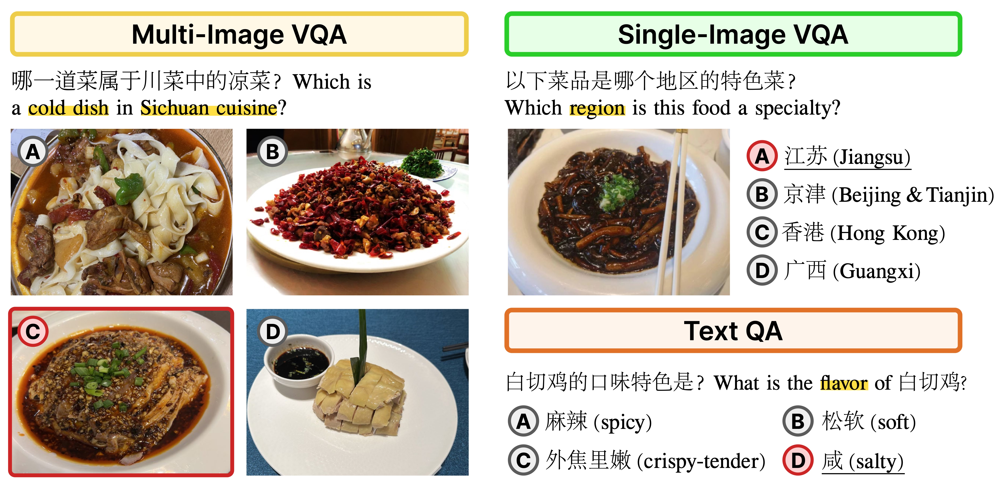

# FoodieQA

Evaluate Chinese food culture understanding of LLMs/VLMs with the FoodieQA benchmark

## Benchmark



🤗 Available on HuggingFace [lyan62/FoodieQA](https://huggingface.co/datasets/lyan62/FoodieQA)

License: [CC-BY-NC-ND 4.0](https://creativecommons.org/licenses/by-nc-nd/4.0/deed.en)

## Models
### Models and results for the VQA tasks
| Evaluation          | Multi-image VQA (ZH) | Multi-image VQA (EN) | Single-image VQA (ZH) | Single-image VQA (EN) |
|---------------------|:--------------------:|:--------------------:|:---------------------:|:---------------------:|
| **Human**           | 91.69                | 77.22†               | 74.41                 | 46.53†                |
| **Phi-3-vision-4.2B** | 29.03               | 33.75                | 42.58                 | 44.53                 |
| **Idefics2-8B**     | **50.87**            | 41.69                | 46.87                 | **52.73**             |
| **Mantis-8B**       | 46.65                | **43.67**            | 41.80                 | 47.66                 |
| **Qwen-VL-12B**     | 32.26                | 27.54                | 48.83                 | 42.97                 |
| **Yi-VL-6B**        | -                    | -                    | **49.61**             | 41.41                 |
| **Yi-VL-34B**       | -                    | -                    | 52.73                 | 48.05                 |
| **GPT-4V**          | 78.92                | 69.23                | 63.67                 | 60.16                 |
| **GPT-4o**          | **86.35**            | **80.64**            | **72.66**             | **67.97**             |

### Models and results for the TextQA task

| Model               | Best Accuracy | Prompt |
|---------------------|:-------------:|:------:|
| Phi-3-medium        | 41.28         | 1      |
| Mistral-7B-instruct | 35.18         | 1      |
| Llama3-8B-Chinese   | 47.38         | 1      |
| YI-6B               | 25.53         | 3      |
| YI-34B              | 46.38         | 3      |
| Qwen2-7B-instruct   | 68.23         | 3      |
| GPT-4               | 60.99         | 1      |

## UI for creating and validating questions

`cd ui`
- See [UI README](ui/README.md) for using the UI to create questions and ground truth labels for Multi-image VQA task.

`cd val-ui`
- See [Val-UI README](val-ui/README_Validation) for using the UI for question validation.

## Model evaluation
- `mkdir <data_folder>`
- Download the dataset from Huggingface [lyan62/FoodieQA](https://huggingface.co/datasets/lyan62/FoodieQA). We use a gated repo to prevent data contamination from web crawlers. Please submit a request for using the dataset.
    - data structure:
        -   /images
        -   sivqa_tidy.json
        -   mivqa_tidy.json
        -   textqa_tidy.json
### Evaluation scripts
- See evaluation scripts in `model-eval/scripts/`
- See example bash file in `model-eval/run`

###  Run open-source models
- set up 
    ```
    conda create -n foodie python=3.9
    pip install -r requirements.txt
    ```

- multi-image VQA:

    For example evaluate the mantis_idefics model:
    ```
    cd model-eval
    python scripts/eval_mantis_idefics.py 
    --data_dir <data_folder> --out_dir <out_folder>
    --cache_dir <hf_cache_dir> --prompt 0
    ```
- single-image VQA:

    evaluate idefics2-8b, mantis-idefics2:

        ```
        python eval_idefics_sivqa.py
        --data_dir <data_folder> --out_dir <out_folder> --cache_dir <hf_cache_dir> --template 0 --model-name <model-name>
        ```
     - `model_name` can be "TIGER-Lab/Mantis-8B-Idefics2" or "HuggingFaceM4/idefics2-8b"
     - template can be 0-3 to indicate which prompt to use
           
    similarly run Qwen-VL model with 
    ```
    python eval_qwen_sivqa.py --data_dir <data_folder> --out_dir <out_folder> --cache_dir <hf_cache_dir> --template 0 --eval_file sivqa_tidy.json
    ```

### Prompts
#### Multi-image VQA:
```
pgeneral = 请从给定选项ABCD中选择一个最合适的答案。
prompt 0 
<img1><img2><img3><img4>
根据以上四张图回答问题，他们分别为图A, 图B, 图C, 图D, (pgeneral), 问题：{}, 答案为：图

promtp 1
<img1>图A
<img2>图B
<img3>图C
<img4>图D
根据以上四张图回答问题, (pgeneral), 问题：{}, 答案为：图

prompt 2
根据以下四张图回答问题,(pgeneral),
<img1>图A
<img2>图B
<img3>图C
<img4>图D
问题：{}, 答案为：图

prompt 3
Human: 问题{}，选项有: 
图A<img1>
图B<img2>
图C<img3>
图D<img4>
Assistant: 如果从给定选项ABCD中选择一个最合适的答案， 答案为：图
```

English prompts:
```
prompt 0 
<img1><img2><img3><img4>
"Answer the following question according to the provided four images, they corresponds 
to Option (A), Option (B), Option (C), Option (D). Choose one best answer from the given options.
Question: {}, your answer is: Option ("

promtp 1
"Answer the following question according to the provided four images which corresponds 
to Option (A), Option (B), Option (C), Option (D). Choose one best answer from the given options.
The options are:
<img1>Option (A)
<img2>Option (B)
<img3>Option (C)
<img4>Option (D)
Question: {}, your answer is: Option ("

prompt 2
"Answer the following question according to the provided four images, 
and choose one best answer from the given options.
The options are:
<img1>Option (A)
<img2>Option (B)
<img3>Option (C)
<img4>Option (D)
Question: {}, your answer is: Option ("

prompt 3
"Human: Question{} The options are: 
Option (A)<img1>
Option (B)<img2>
Option (C)<img3>
Option (D)<img4>
Assistant: If I have to choose one best answer from the given options， the answer is：Option ("
```

#### Single-image VQA
See `format_text_prompt()` in `model-eval/scripts/sivqa_utils.py` 
https://github.com/lyan62/foodie-eval/blob/76a22ee16fb58bb090c0ad3eb1f35e39fc71687e/model-eval/scripts/sivqa_utils.py#L30


